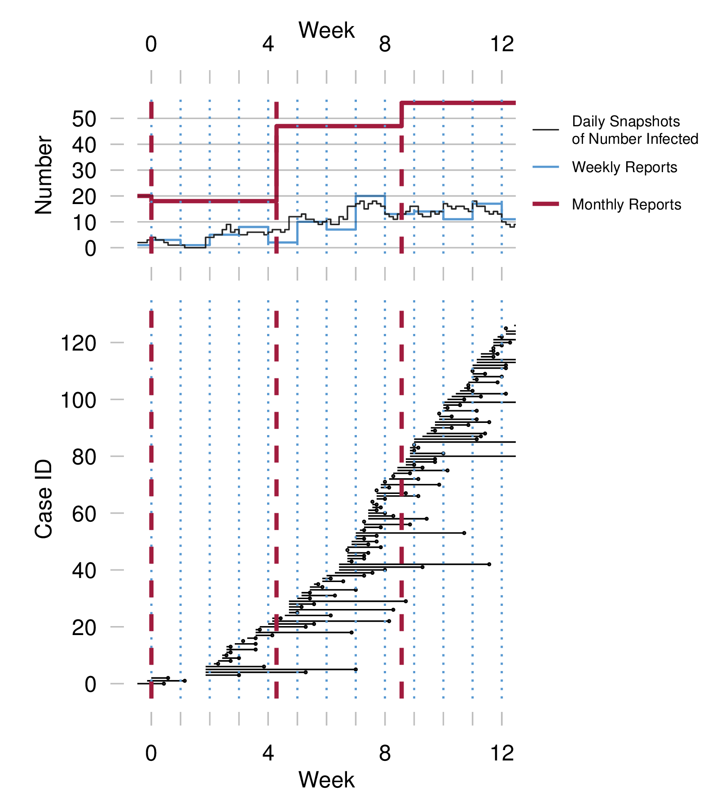

# Load Dependencies

```{r eval=FALSE}
source("R/helpers.R")

# Loads built-in packages
library(graphics) # standard R package
library(grDevices) # standard R package
library(utils) # standard R package
library(stats) # standard R package

# usePackage() installs package if not installed, then loads the package
usePackage("magick") # for conversion of vector plots to bitmap images
usePackage("magrittr")
usePackage("data.tree") # to document project folder structure

# ensure custom spaero (version 0.2.0.9000) installed and loaded
if(require(spaero)) detach(package:spaero)
if("spaero" %in% rownames(installed.packages()) == TRUE && packageVersion("spaero") != "0.2.0.9000") {
    remove.packages("spaero")
    install.packages("install/spaero_0.2.0.9000.tar.gz", repos = NULL, type="source")
}else{
  if("spaero" %in% rownames(installed.packages()) == FALSE) {
    install.packages("install/spaero_0.2.0.9000.tar.gz", repos = NULL, type="source")
  }
}
library(spaero)

```

# Session info

```{r}
sessionInfo()
```


# Project structure

```{r echo = FALSE}
thisdir <- "."
filelist <- list.files(path = thisdir, recursive = TRUE, include.dirs = TRUE) 
ls <- data.frame(
      filename = sapply(filelist, function(file) paste0(".","/",file)), 
      file.info(paste(thisdir, filelist, sep = "/")),
      stringsAsFactors = FALSE
    )
fileStructure <- as.Node(ls, pathName = "filename")
fileStructure
```


# Summary of senarios:
  
recovery rate = {1/7, 1/30} per day  
reporting probability $\rho$ = 2 ^ seq(from = -8, to = 0, length = 21)  
neg. binomial dispersion = {0.01, 0.1, 1, 10, 100}  
number of days for each case report = {7, 30, 365}  

2 \* 21 \* 5 \* 3 = 630 unique combinations

reporting_prob $\rho$:  
  - 2 ^ seq(from = -8, to = 0, length = 21)  
dispersion_parameter (high value reduces dispersion):  
  - .01 to 100 (high to low dispersion)  

  
## Fig 2. Scenario #1: 

- Infection period = 7 days  
- Reporting period = 7 days vs 30 days 

  
```{r}

# Random Number Generator state recall in a robust, portable way, for reproducibility

# Restore random number generator state from file
load("./data/RNGdata20170602_163629.Rdata")
RNGversion(RNGversion) # enforces RNG version
do.call("RNGkind",as.list(RNGkind)) # enforces RNG kind
.Random.seed <- RNGseed # restore seed to global environment

# parameters
observation_days = 20 * 365
sampling_interval <- 1 # simulation sampling interval in days
tau <- 7  # reporting interval in days
infectious_days <- 7  # infectious period in days
reporting_prob <- 1.0
dispersion_parameter <- 100

# do simulation
sim.7di <- sample_process(observation_days = observation_days,
                          sampling_interval=sampling_interval, 
                          infectious_days = infectious_days)

# Data must be coerced to a time series first, setting start time to the minimum time in dataframe (0 in this case), otherwise aggregate.ts() will coerce the data to a time series starting at time 1.  
sim.7di.cases <- ts(sim.7di$cases, start = sim.7di$time[1])  

# aggregate reports ( 7 day reporting period)
reports.7di.7dr.perfect <- aggregate.ts(sim.7di.cases, # changed from sim.7di$cases
                                        nfrequency=1 / (7/sampling_interval)
                                        )

# aggregate reports ( 30 day reporting period)
reports.7di.30dr.perfect <- aggregate.ts(sim.7di.cases, # changed from sim.7di$cases
                                        nfrequency=1 / (30/sampling_interval)
                                        )


# ## for imperfect reporting, use sample_observations() and specify reporting prob and dispersion
# reports.7di.7dr.hrp.ldisp <- sample_observation(sim.7di$cases, # use sim.7di.cases instead
#                                                 aggregation_days = tau/sampling_interval,
#                                                 reporting_prob = reporting_prob,
#                                                 dispersion_parameter = dispersion_parameter
#                                                 )

# extract caselist (under perfect reporting) (flows from I to S))
caselist <- sim.7di[rep(seq(nrow(sim.7di)), sim.7di$cases), c("time", "cases")]
caselist$cases <- caselist$cases != 0

# extract list of transmissions (flows from S to I)
transmissionlist <- sim.7di[rep(seq(nrow(sim.7di)), sim.7di$transmissions), c("time", "transmissions")]
transmissionlist$transmissions <- transmissionlist$transmissions != 0
rownames(transmissionlist) <- NULL

# extract list of deaths of I
deathlist <- sim.7di[rep(seq(nrow(sim.7di)), sim.7di$deathsI), c("time", "deathsI")]
deathlist$deathsI <- deathlist$deathsI != 0

# merged list of deaths of I (I --> death) and "cases" (I --> R)
caseanddeathlist <- merge(caselist,deathlist,all=TRUE) # renumbered


## random heights for bars - TODO: extract this into a helper function
# heights <- rnorm(n=sum(sim.7dayinfectious$cases),mean=0,sd=1.5)
# heights <- runif(n=sum(sim.7dayinfectious$cases),min=-4.4,max=4.5)

height.levels <- 35
heights <- as.vector(
  replicate(
    ceiling(sum(transmissionlist$transmissions)/height.levels), # number of calls
    c(
      sample(1:height.levels, height.levels, replace=F)+runif(1,-.25,.25),
      sample(1:height.levels, height.levels, replace=F)+runif(1,-.25,.25)+.5
      )
    )
  )[1:length(transmissionlist$time)]

## TODO: there was a request to try this version with non-random heights (stacked). 
## Alternately, there is a need to show in a better way that height is not meaningful.

# ## Alt heights - sequential
# 
# heights <- as.vector(
#   replicate(
#     ceiling(sum(transmissionlist$transmissions)/height.levels), # number of calls
#     1:height.levels
#     )
#   )[1:length(transmissionlist$time)]


# Set plotting window (days)
plotxmin <- 7*52*15 # days
plotxlength <- 180 # days
plotxmax <- plotxmin+plotxlength # days

## About Devices: Plot is made to the PDF device.  After the PDF device is closed, the figure is read in as an image and converted  to PNG.

# # PDF output
pdf(
  file = "./output/plots/fig2.pdf",
  title = "Figure 2",
  width = 7, height=7
  )

# # PNG output
# # png("variance-vs-vaccine-uptake_zero-max.png", width = 600, height = 960, pointsize = 20)
# png(filename="./output/plots/fig2.png", 
#     type="cairo",
#     units="in", 
#     width=7, 
#     height=7, 
#     pointsize=12, 
#     res=300)


# Initialize plot of individual infections as multiple line segments
par(fig=c(0,1,0,.6))
plot(0,0, type='n', axes=FALSE, ann=FALSE, yaxt="n",
     xlim=c(plotxmin,plotxmax), ylim=c(min(heights)-3,max(heights)+3))

# plot cases with actual transmission times (onsets), random pairing
## Each case time is paired with a random transmission time <= case time.
## For some cases, case time == transmission time
tmp_transmissionlist <- transmissionlist

for(i in 1:length(transmissionlist$time)){  
    
    # heightvector <- heights[i]+runif(caselist$cases[i],-5,5) ## runif = KLUDGE

    offsettime <- caseanddeathlist$time[i]
    onsetindex <- sample(1:nrow(tmp_transmissionlist[tmp_transmissionlist$time<=offsettime,]),1)
    # onsettime <- sample(transmissionlist$time[1:"firstindexwhosetimeis less than time of R[i]"],1)
    
    height <- heights[i] # pseudo random
    # height <- sim.7di[sim.7di$time == caseanddeathlist$time[i],]$I # stacked (not working)
    
    segments(
      x0 = tmp_transmissionlist$time[onsetindex],
      y0 = height,
      
      # x1 = recovery, death or end of obs period:
      x1 = ifelse(!is.na(caseanddeathlist$time[i]),caseanddeathlist$time[i],observation_days), 
      y1 = height
      )
    points(
      x = ifelse(!is.na(caseanddeathlist$time[i]),caseanddeathlist$time[i],observation_days),
      y = height,
      pch = ifelse(caseanddeathlist$cases[i]==TRUE,16,NA)
      )

    tmp_transmissionlist <- tmp_transmissionlist[-onsetindex, , drop = FALSE]    
    
}
axis(side = 1, # 1 specifies bottom axis
           at = seq(plotxmin,plotxmax,7), # vector of tick locations (in data units).
           labels = seq(plotxmin,plotxmax,7), # vector of tick labels
           las = 1, # label orientation (0:parall., 1:horiz., 2:perp., 3:vert.)
           tck = -.05, # tick length (fraction of plot width, neg to draw outside plot)
           pos = -1, # axis position, in units of y data
           lty = "solid",
           lwd = 1, # axis line weight
           lwd.ticks = 1, # tick line weight
           col = "grey" # axis line color
           # col.ticks = NULL, # tick line color
        )# abline(v=caselist$time) # case times
title(xlab="observation day")

# plot observation window dividers
abline(v=(7*0:(observation_days/7))-.0, col=rgb(1,0,0,.5))  # slightly shifted version: abline(v=(7*0:(observation_days/7))-.1, col=rgb(1,0,0,.5))v
abline(v=(30*0:(observation_days/30))-.0, col=rgb(0,0,1,.5), lty=2)  # slightly shifted version: abline(v=(7*0:(observation_days/7))-.1, col=rgb(1,0,0,.5))

# initialize plot of time series
par(fig=c(0,1,.35,1), new=TRUE)

# plot time series of reports (7 day)
plot(reports.7di.7dr.perfect, type='s', lwd=3, xaxt="n", xlab="", ylab="number of cases", col=rgb(1,0,0,.5), bty='n',
     xlim=c(plotxmin,plotxmax),  # KLUDGE: xlim=c(plotxmin+1,plotxmax+1) compensates for type='s' - may no longer be needed with fixed time seres aggregation
     ylim=c(0,max(window(reports.7di.30dr.perfect,plotxmin-30,plotxmax+30)))  # max 30day reports in window
     )  

# plot time series of reports (30 day)
lines(reports.7di.30dr.perfect, type='s', lwd=3, col=rgb(0,0,1,.5))

# plot time series of true cases
lines(sim.7di$I, type='s')

# grid lines
abline(
  h=seq(0,max(window(reports.7di.30dr.perfect,plotxmin-30,plotxmax+30)),by=20),
  col=grey(.5), 
  lty=2
  )
# plot observation window dividers
abline(v=(7*0:(observation_days/7))-.0, col=rgb(1,0,0,.5)) # slightly shifted version: abline(v=(7*0:(observation_days/7))-.1, col=rgb(1,0,0,.5))
abline(v=(30*0:(observation_days/30))-.0, col=rgb(0,0,1,.5), lty=2) # slightly shifted version: abline(v=(7*0:(observation_days/7))-.1, col=rgb(1,0,0,.5))

# annotations
text(x=plotxmax, y = 3, "true", las=1, adj=1, col=rgb(0,0,0,1))
text(x=plotxmax, y = 15, "weekly", las=1, adj=1, col=rgb(1,0,0,.5))
text(x=plotxmax, y = 45, "monthly", las=1, adj=1, col=rgb(0,0,1,.5))


## Close PDF
dev.off()

## convert figure from PDF to PNG
path <- "./output/plots/fig2.pdf"
targetfmt <- "png"
pdf <- image_read(path, density = "300x300")
png <- image_convert(pdf, format=targetfmt, depth=8)
image_write(png, path = paste0(path,".", format=targetfmt), format = targetfmt)

```



Figure 2. Illustration of the reporting process under perfect reporting, for a disease with average infectious period of 7 days.  In the lower panel, each line segment represents the infectious period (start to end of infection) of a simulated individual somewhere in the population.  Each dot represents a case report, which in this simulation corresponds to the end of the infection ($I \rightarrow R$ transitions).  Red vertical lines delineate one-week reporting windows; dotted blue vertical lines delineate delineate 30-day reporting windows.  Counting the muber of segments present at any given time gives the true number of infected, plotted as a black line in the upper plot.  Counting the number of dots in a given window gives the nuber of case reports for that window, plotted as red (7-day) and blue (30-day) traces in the upper plot.  

```{r}
plot(reports.7di.7dr.perfect, type='s', lwd=2, xlab="", ylab="number of cases", col=rgb(1,0,0,.5), bty='n',
     ylim=c(0,max(window(reports.7di.30dr.perfect,plotxmin-30,plotxmax+30)))  # max 30day reports in window
     )  

# plot time series of reports (30 day)
lines(reports.7di.30dr.perfect, type='s', lwd=2, col=rgb(0,0,1,.5))

# plot time series of true cases
lines(sim.7di$I, type='s')

```

